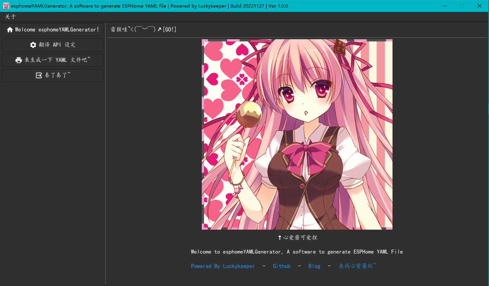
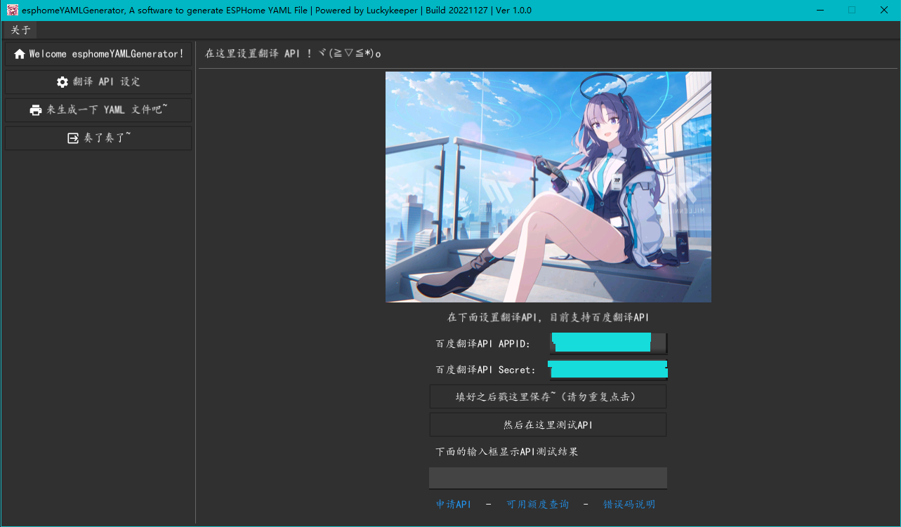
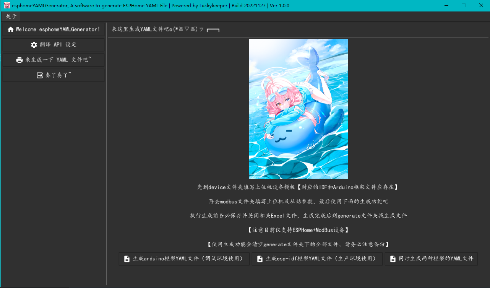

# esphomeYAMLGenerator
使用 Excel 模板快速生成 ESPHome 的 YAML （arduino和esp-idf两种）对接 HA （目前仅支持ModBus设备）

## 介绍

[Home Assistant（简称 HA ）](https://home-assistant.io/) 可以接入众多智能设备，是目前建设智能家庭的一种较好的方案，因其强大的生态，使用场景已不仅仅局限于智能家居建设，机房动环监测，工业现场监测有时也会使用 HA 方案来对设备、温度、湿度、门禁、烟感、动力等进行监测。而现场设备往往使用 [ModBus](https://modbus.org/) 通信（物理端口一般采用 RS-485 或是 RS-232），在对接 HA 时，往往会使用 ESP32/ESP8266 设备刷入 [ESPHome](https://esphome.io/) 作为上位机采集从站（现场设备）数据。

在一般智慧家庭建设中，因为设备较少，且同一设备的功能相对较少，手动填写生成模板需要花费的时间并不会很多。而在机房动环监测或工业现场监测中，往往面临设备数量多，单台设备指标数量多（某些设备告警可能都有上百项），此时再去手动填写生成模板就会变成费时费力，枯燥无味的重复劳动了，本工具旨在让使用者从这样的重复劳动中解放出来，于是写了这个小工具，并将其开源出来。实测中，通过使用本工具，在短短 7~8 分钟的时间内，就可以快速完成100多条指标的生成，生成一千余行的 YAML 文件，极大地提升了效率。

## 使用方法

### 基本使用

#### 软件界面介绍

软件基本界面如下（提示：点击箭头可以展开），左侧是菜单，右侧是功能区，软件运行后会自动进入欢迎界面，同时在任务栏会有一个图标

<details> <summary>基本界面截图</summary>   <p></p></details>

翻译 API 设定界面如下，由于 ESPHome 对中文的支持不好，加上 YAML 的 id 不允许使用中文，这里使用翻译 API 将中文翻译成英文后加以处理再用来生成模板，考虑到使用的便利性，这里选择了百度翻译的 API ，**在生成模板前必须先配置这里的 API 设置**。在填写完成后，点击下面的测试按钮测试 API 是否可以正常使用，如果正常，会显示 “百度翻译API测试成功！可正常生成YAML文件！”，如果显示了其它内容说明 API 调用出现了问题，可以在下面的“错误码说明”（百度翻译 API 文档）中查找失败原因

<details> <summary>翻译 API 设置界面截图</summary>   <p></p></details>

接下来是就是生成界面，在这里可以生成 ESPHome 的 YAML 文件，调试时使用 arduino 框架（有 WEB 界面方便查看和调试），生产环境使用 ESP-IDF 框架（更稳定，但是没有 WEB 界面）。软件可以同时生成两种框架的文件，也可以单独生成其中一种

<details> <summary>生成界面截图</summary>   <p></p></details>

#### 模板使用方法

使用生成功能前除了需要填写翻译 API 设定数据，还需要先完成模板的填写，流程是

填写翻译 API 数据（在软件中）->填写设备模板（在 device 下的两个文件夹下）->填写主从站模板（在 modbus 文件夹内）->生成对应文件（在 generate 文件夹内）

**填写设备模板**

在 device 文件夹下有 arduino 和 esp-idf 两个文件夹，生成哪个框架的文件就需要在对应的文件夹放置相应的文件，同一设备在 arduino 和 esp-idf 两个文件夹下的名字应相同。在 arduino 和 esp-idf 两个文件夹下有一个名字为 `esp32-c3-485-template.txt` 的文件，该文件为模板文件，不建议删除，可将此文件复制一份再进行修改（复制出来的文件可随意命名）。一个文件夹内允许有多个模板文件，在后面填写主从站模板时注意正确填写设备模板的名称（即文件名，不需要带后缀）

**填写主从站模板**

在 modbus 文件夹内有 `ModBus_Template.xlsx` 文件，**这是主从站模板文件，请勿删除**。使用时，先将此文件复制一份（复制出来的文件可随意命名），再进行填写。模板文件内有如何填写的说明和样例，请仔细查看。

### 进阶使用

#### ①使用非 ESP32-C3 设备

device 文件夹内提供的模板文件对应的硬件是合宙的 ESP32-C3 （12.9元的标准版和9.9元的简约版）的模板，如果你使用其它设备，那么你很可能需要更改如下部分

```yaml
# 以下两节内容必须修改以适配你手中的硬件，具体填写请参照 ESPHome 中的文档
esphome:

esp32:
```

#### ②关于设备模板中变量的说明

设备模板中的变量，如设备名称等，都采用了 `cocoa+变量名称`的命名方法，如果你想修改包含变量的部分，比如修改固定 IP 变为 DHCP（一般接 ModBus 场景固定 IP 情况较多，设备模板给定的是固定 IP），直接改动相关内容即可，但是注意已有变量不能再次使用（比如把`cocoaDeviceIp`作为设备 OTA 密码）

#### ③二次开发

如果模板无法满足你的需求，你可能需要修改源码，进行二次开发

程序使用 Go 编写，你需要有 Go 编程知识， GUI 使用 fyne 开发，生成 arudino 框架文件的方法为 `generateArduino()` ，生成 ESP-IDF 框架的方法为 `generateESPIDF()`
